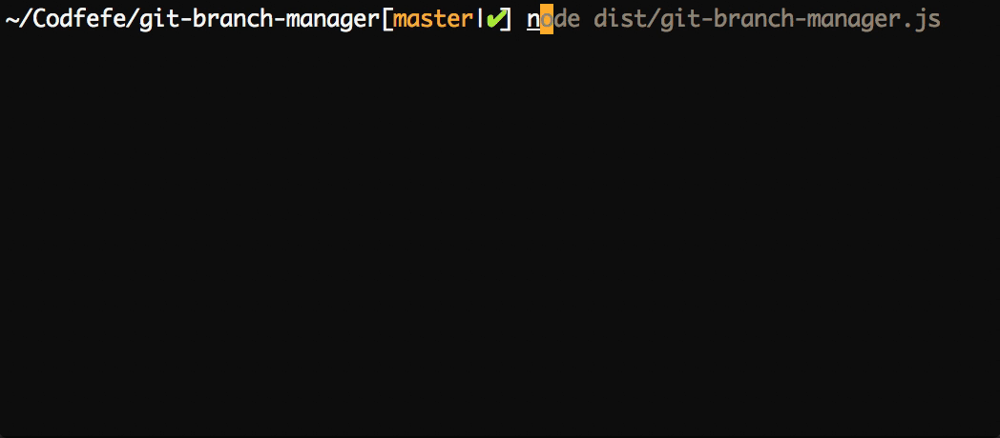

# Git Branch Manager 

The [Git Branch Manager](https://github.com/olivermicke/git-branch-manager/) lists all your
branches and allows you to quickly checkout or delete them with less than a handful of
key-strokes.

Instead of typing out the commands, they are created for you. In order to ensure that no git
history is destroyed accidentally, you have to confirm the command before it is executed.

### Demo

The text styles of branches mean the following:

- Bold: Your current branch.
- Underlined: Recently checked out branches.
  This is especially helpful if you have a bigger number of local branches.
- "[inactive]": There was no commit on this branch in the last week.
  Should you have forgotten to delete no longer needed branches for some time, this
  helps you quickly identify them.
